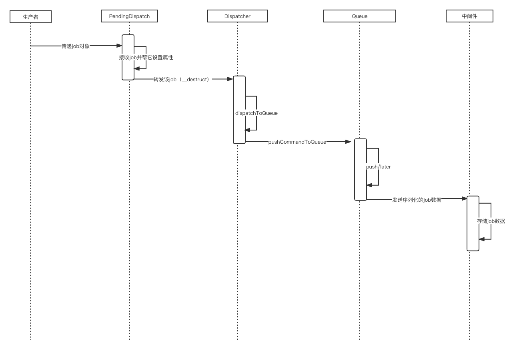
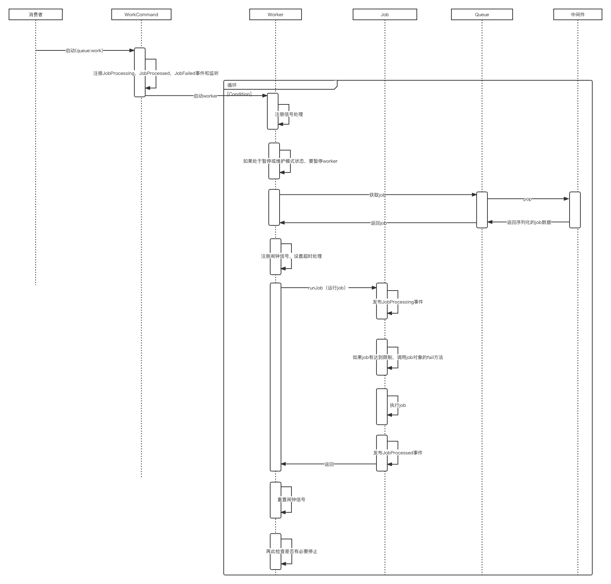
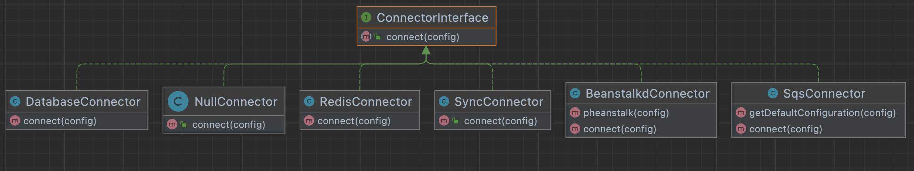
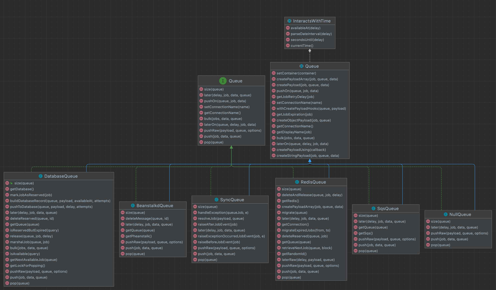
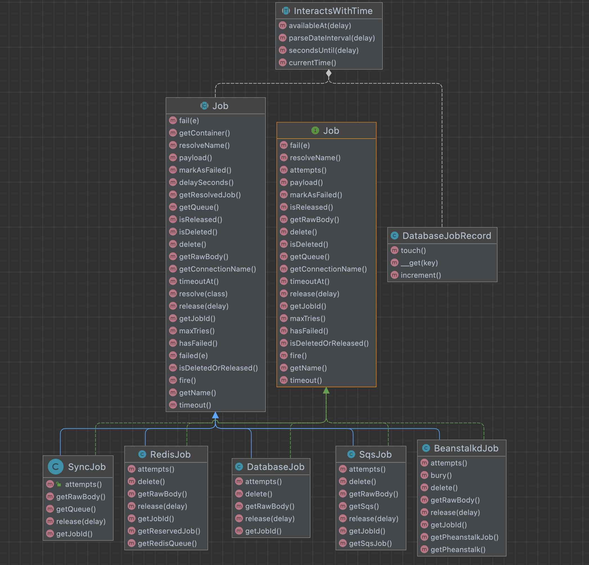
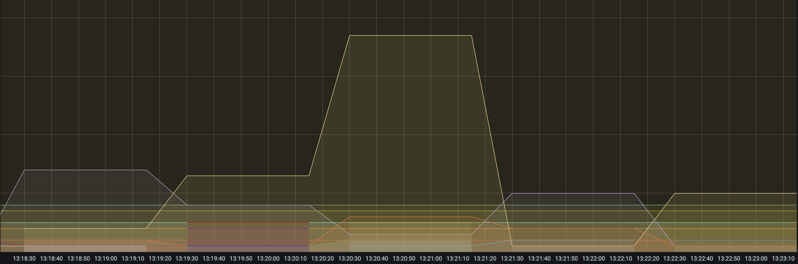
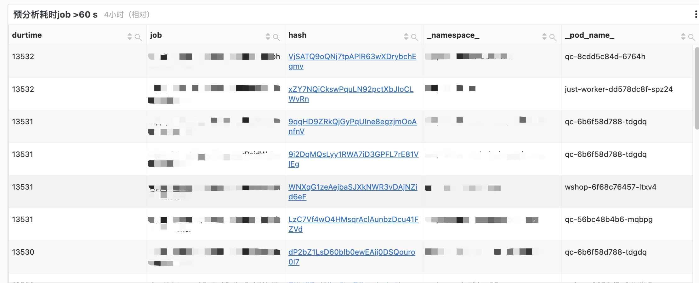
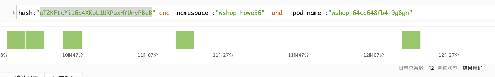

# 队列源码解析及实践

## 什么是队列

队列是一种先进先出(FIFO)数据结构。进数据的一端称为队尾，出数据的一端称为队头。将元素从队尾进入称为入队，将元素从队头弹出称为出队。

{ loading=lazy }

## 队列可以解决哪些问题

同步转异步，降低耗时

微服务的通信

## 流程概览

### 生产者发布job的流程	

{ loading=lazy }


### 消费者处理job的流程

{ loading=lazy }

## 队列实现


### QueueManager 类

- 维护队列的驱动(driver)

```php
   
  	//数据内容如下
    [
    'Null'=>function(){
        return new NullConnector;
    },
    'Sync'=>function(){
        return new SyncConnector;
    },
    'Database'=>function(){
        return new DatabaseConnector($this->app['db']);
    },
    'redis'=>function(){
        return new RedisConnector($this->app['redis']);
    },
    'beanstalkd'=>function(){
        return new BeanstalkdConnector;
    },
    'sqs'=>function(){
        return new SqsConnector;
    }

    ];
    
    //驱动数组
    protected $connectors = [];
    
    //添加驱动
    public function addConnector($driver, Closure $resolver)
    {
        $this->connectors[$driver] = $resolver;
    }
```

- 动态方法转发给默认队列的连接去处理（根据配置，通过驱动，建立队列的连接）

```
    //转发给默认队列的连接去处理
    public function __call($method, $parameters)
    {
        return $this->connection()->$method(...$parameters);
    }
    //
    public function connection($name = null)
    {
    		//获取默认驱动
    		// $this->app['config']['queue.default']
        $name = $name ?: $this->getDefaultDriver();

        // If the connection has not been resolved yet we will resolve it now as all
        // of the connections are resolved when they are actually needed so we do
        // not make any unnecessary connection to the various queue end-points.
        if (! isset($this->connections[$name])) {
        		//解析队列驱动的连接，并保存到connections属性
            $this->connections[$name] = $this->resolve($name);

            $this->connections[$name]->setContainer($this->app);
        }

        return $this->connections[$name];
    }
    //根据配置，建立队列驱动的连接
    protected function resolve($name)
    {
        $config = $this->getConfig($name);

        return $this->getConnector($config['driver'])
                        ->connect($config)
                        ->setConnectionName($name);
    }
    //从connectors属性拿到驱动
    protected function getConnector($driver)
    {
        if (! isset($this->connectors[$driver])) {
            throw new InvalidArgumentException("No connector for [$driver]");
        }

        return call_user_func($this->connectors[$driver]);
    }
```

### Connector（驱动/连接器） 

laravel 提供了6种驱动的实现，分别是database, sync,sqs,redis,null, beanstalkd.这些驱动都实现了ConnectorInterface接口的connect方法，去建立连接。



- RedisConnector

```
    public function connect(array $config)
    {
        return new RedisQueue(
            $this->redis, $config['queue'],
            $config['connection'] ?? $this->connection,
            $config['retry_after'] ?? 60,
            $config['block_for'] ?? null
        );
    }
```

- DatabaseConnector

```
    public function connect(array $config)
    {
        return new DatabaseQueue(
            $this->connections->connection($config['connection'] ?? null),
            $config['table'],
            $config['queue'],
            $config['retry_after'] ?? 60
        );
    }
```

- SyncConnector

```
    public function connect(array $config)
    {
        return new SyncQueue;
    }
```

- NullConnector

```
    public function connect(array $config)
    {
        return new NullQueue;
    }
```

- SqsConnector

```
    public function connect(array $config)
    {
        $config = $this->getDefaultConfiguration($config);

        if (! empty($config['key']) && ! empty($config['secret'])) {
            $config['credentials'] = Arr::only($config, ['key', 'secret', 'token']);
        }

        return new SqsQueue(
            new SqsClient($config), $config['queue'], $config['prefix'] ?? ''
        );
    }
```

- BeanstalkdConnector

```
    public function connect(array $config)
    {
        return new BeanstalkdQueue(
            $this->pheanstalk($config),
            $config['queue'],
            $config['retry_after'] ?? Pheanstalk::DEFAULT_TTR,
            $config['block_for'] ?? 0
        );
    }
```

### Queue 接口和实现

RedisQueue，DatabaseQueue，SyncQueue，NullQueue，SqsQueue，BeanstalkdQueue等类全部实现了Queue接口

{ loading=lazy }

#### queue接口

```
interface Queue
{
    // 获取队列的长度
    public function size($queue = null);

    //job入列
    public function push($job, $data = '', $queue = null);

    //job入列
    public function pushOn($queue, $job, $data = '');

    //job入列
    public function pushRaw($payload, $queue = null, array $options = []);

    //job延迟入列
    public function later($delay, $job, $data = '', $queue = null);

    //job延迟入列
    public function laterOn($queue, $delay, $job, $data = '');

  	//job批量入列
    public function bulk($jobs, $data = '', $queue = null);

    //出列
    public function pop($queue = null);

   	//获取队列的连接名称
    public function getConnectionName();

    //设置队列的连接名称
    public function setConnectionName($name);
}
```

#### queue实现

介于篇幅，这里选择讲解DatabaseQueue和RedisQueue的实现

##### DatabaseQueue类

数据库队列用的是jobs的表做队列的存储

```
    Schema::create('jobs', function (Blueprint $table) {
            $table->bigIncrements('id');
            $table->string('queue')->index(); //队列名称
            $table->longText('payload'); //荷载
            $table->unsignedTinyInteger('attempts');//尝试次数,默认为0
            $table->unsignedInteger('reserved_at')->nullable();//保留的时间点
            $table->unsignedInteger('available_at');//可用的时间点，和延迟队列有关系
            $table->unsignedInteger('created_at');//创建时间
        });
```

获取指定队列的长度

```
    public function size($queue = null)
    {
        return $this->database->table($this->table)
                    ->where('queue', $this->getQueue($queue))
                    ->count();
    }
```

job入列（push方法）

```
    //job入列
    public function push($job, $data = '', $queue = null)
    {
        return $this->pushToDatabase($queue, $this->createPayload(
            $job, $this->getQueue($queue), $data
        ));
    }
    //插入jobs表
    protected function pushToDatabase($queue, $payload, $delay = 0, $attempts = 0)
    {
        return $this->database->table($this->table)->insertGetId($this->buildDatabaseRecord(
            $this->getQueue($queue), $payload, $this->availableAt($delay), $attempts
        ));
    }
    //构建数据记录
    protected function buildDatabaseRecord($queue, $payload, $availableAt, $attempts = 0)
    {
        return [
            'queue' => $queue,
            'attempts' => $attempts,
            'reserved_at' => null,
            'available_at' => $availableAt,
            'created_at' => $this->currentTime(),
            'payload' => $payload,
        ];
    }
    // 可用时间=now+delay，和延迟队列队列有关
    protected function availableAt($delay = 0)
    {
        $delay = $this->parseDateInterval($delay);

        return $delay instanceof DateTimeInterface
                            ? $delay->getTimestamp()
                            : Carbon::now()->addRealSeconds($delay)->getTimestamp();
    }
    --------------------------------------------------------------------------------
    // 创建荷载(payload)
    protected function createPayload($job, $queue, $data = '')
    {
    		//把job序列化为json
        $payload = json_encode($this->createPayloadArray($job, $queue, $data));

        if (JSON_ERROR_NONE !== json_last_error()) {
            throw new InvalidPayloadException(
                'Unable to JSON encode payload. Error code: '.json_last_error()
            );
        }

        return $payload;
    }
    
    protected function createPayloadArray($job, $queue, $data = '')
    {
        return is_object($job)
                    ? $this->createObjectPayload($job, $queue)
                    : $this->createStringPayload($job, $queue, $data);
    }
    // 创建对象型的荷载
    protected function createObjectPayload($job, $queue)
    {
        $payload = $this->withCreatePayloadHooks($queue, [
            'displayName' => $this->getDisplayName($job),
            'job' => 'Illuminate\Queue\CallQueuedHandler@call',
            'maxTries' => $job->tries ?? null,
            'delay' => $this->getJobRetryDelay($job),//多久重试
            'timeout' => $job->timeout ?? null,
            'timeoutAt' => $this->getJobExpiration($job),//超时时间点
            'data' => [
                'commandName' => $job,
                'command' => $job,
            ],
        ]);

        return array_merge($payload, [
            'data' => [
                'commandName' => get_class($job),
                'command' => serialize(clone $job),
            ],
        ]);
    }
    // 创建字符串型的荷载
    protected function createStringPayload($job, $queue, $data)
    {
        return $this->withCreatePayloadHooks($queue, [
            'displayName' => is_string($job) ? explode('@', $job)[0] : null,
            'job' => $job,
            'maxTries' => null,
            'delay' => null,
            'timeout' => null,
            'data' => $data,
        ]);
    }
    //    
    public function getJobRetryDelay($job)
    {
        if (! method_exists($job, 'retryAfter') && ! isset($job->retryAfter)) {
            return;
        }
				//retryAfter属性或者retryAfter方法
        $delay = $job->retryAfter ?? $job->retryAfter();

        return $delay instanceof DateTimeInterface
                        ? $this->secondsUntil($delay) : $delay;
    }
    
    public function getJobExpiration($job)
    {
        if (! method_exists($job, 'retryUntil') && ! isset($job->timeoutAt)) {
            return;
        }

        $expiration = $job->timeoutAt ?? $job->retryUntil();

        return $expiration instanceof DateTimeInterface
                        ? $expiration->getTimestamp() : $expiration;
    }
    
```

job入列（pushRaw方法）

```
    public function pushRaw($payload, $queue = null, array $options = [])
    {
        return $this->pushToDatabase($queue, $payload);
    }
```

job入列（pushOn方法）

```
    public function pushOn($queue, $job, $data = '')
    {
        return $this->push($job, $data, $queue);
    }
```

job批量入列（bulk方法）

```
    //批量的把job加入队列
    public function bulk($jobs, $data = '', $queue = null)
    {
        foreach ((array) $jobs as $job) {
            $this->push($job, $data, $queue);
        }
    }
```

job延迟入列（later方法）

```
    //和push方法差不多
    public function later($delay, $job, $data = '', $queue = null)
    {
        return $this->pushToDatabase($queue, $this->createPayload(
            $job, $this->getQueue($queue), $data
        ), $delay);
    }
    
```

job延迟入列（laterOn方法）

```
    //调用later方法
    public function laterOn($queue, $delay, $job, $data = '')
    {
        return $this->later($delay, $job, $data, $queue);
    }
```

job出列

```
    public function pop($queue = null)
    {
        $queue = $this->getQueue($queue);

        return $this->database->transaction(function () use ($queue) {
        		//从队列里获取下一个可用的job
            if ($job = $this->getNextAvailableJob($queue)) {
            		//标记job的为保留	
                return $this->marshalJob($queue, $job);
            }
        });
    }
    ----------------------------------------------
    //从队列里获取下一个可用的job
    protected function getNextAvailableJob($queue)
    {
        $job = $this->database->table($this->table)
                    ->lock($this->getLockForPopping())
                    ->where('queue', $this->getQueue($queue))
                    ->where(function ($query) {
                        $this->isAvailable($query);
                        $this->isReservedButExpired($query);
                    })
                    ->orderBy('id', 'asc')
                    ->first();

        return $job ? new DatabaseJobRecord((object) $job) : null;
    }
    // 当前时间比可用的时间点大，说明可被使用
    protected function isAvailable($query)
    {
        $query->where(function ($query) {
            $query->whereNull('reserved_at')
                  ->where('available_at', '<=', $this->currentTime());
        });
    }
    // 
    protected function isReservedButExpired($query)
    {
        $expiration = Carbon::now()->subSeconds($this->retryAfter)->getTimestamp();

        $query->orWhere(function ($query) use ($expiration) {
            $query->where('reserved_at', '<=', $expiration);
        });
    }
    
    protected function marshalJob($queue, $job)
    {
       //标记job的为保留
        $job = $this->markJobAsReserved($job);
				//构建job对象
        return new DatabaseJob(
            $this->container, $this, $job, $this->connectionName, $queue
        );
    }
    ----------------------------------------------
    protected function markJobAsReserved($job)
    {
        //设置job的reserved_at为当前时间
        //设置job的attempts的次数+1
        $this->database->table($this->table)->where('id', $job->id)->update([
            'reserved_at' => $job->touch(),
            'attempts' => $job->increment(),
        ]);

        return $job;
    }
```

##### RedisQueue类

Redis队列用的是redis的list和sorted set做队列的存储


获取指定队列的长度

```
    public function size($queue = null)
    {
        $queue = $this->getQueue($queue);
				//通过lua脚本，计算长度值=queue + queue:delayed + queue:reserved
        return $this->getConnection()->eval(
            LuaScripts::size(), 3, $queue, $queue.':delayed', $queue.':reserved'
        );
    }
    // https://redis.io/commands/zcard/
    // https://redis.io/commands/llen/
    public static function size()
    {
        return <<<'LUA'
return redis.call('llen', KEYS[1]) + redis.call('zcard', KEYS[2]) + redis.call('zcard', KEYS[3])
LUA;
    }
```

job入列（push方法）

```
    public function push($job, $data = '', $queue = null)
    {
        return $this->pushRaw($this->createPayload($job, $this->getQueue($queue), $data), $queue);
    }
    
    public function pushRaw($payload, $queue = null, array $options = [])
    {
        $this->getConnection()->eval(
            LuaScripts::push(), 2, $this->getQueue($queue),
            $this->getQueue($queue).':notify', $payload
        );

        return json_decode($payload, true)['id'] ?? null;
    }
    // https://redis.io/commands/rpush/
    // list数据类型，job入列
    public static function push()
    {
        return <<<'LUA'
-- Push the job onto the queue...
redis.call('rpush', KEYS[1], ARGV[1])
-- Push a notification onto the "notify" queue...
redis.call('rpush', KEYS[2], 1)
LUA;
    }
```

job入列（pushRaw方法）

```
    public function pushRaw($payload, $queue = null, array $options = [])
    {
        $this->getConnection()->eval(
            LuaScripts::push(), 2, $this->getQueue($queue),
            $this->getQueue($queue).':notify', $payload
        );

        return json_decode($payload, true)['id'] ?? null;
    }
```

job入列（pushOn方法）

```
    public function pushOn($queue, $job, $data = '')
    {
        return $this->push($job, $data, $queue);
    }
```

job批量入列（bulk方法）

```
    public function bulk($jobs, $data = '', $queue = null)
    {
        foreach ((array) $jobs as $job) {
            $this->push($job, $data, $queue);
        }
    }
```

job延迟入列（later方法）

```
    public function later($delay, $job, $data = '', $queue = null)
    {
        return $this->laterRaw($delay, $this->createPayload($job, $this->getQueue($queue), $data), $queue);
    }
    //sorted set数据类型
    protected function laterRaw($delay, $payload, $queue = null)
    {
    		// 延迟的时间点作为分数值
        $this->getConnection()->zadd(
            $this->getQueue($queue).':delayed', $this->availableAt($delay), $payload
        );

        return json_decode($payload, true)['id'] ?? null;
    }
    
    protected function availableAt($delay = 0)
    {
        $delay = $this->parseDateInterval($delay);

        return $delay instanceof DateTimeInterface
                            ? $delay->getTimestamp()
                            : Carbon::now()->addRealSeconds($delay)->getTimestamp();
    }
```

job延迟入列（laterOn方法）

```
    public function laterOn($queue, $delay, $job, $data = '')
    {
        return $this->later($delay, $job, $data, $queue);
    }
```

job出列

```
    public function pop($queue = null)
    {
        //迁移  delayed or expired jobs 进入主队列
        $this->migrate($prefixed = $this->getQueue($queue));
				//获取下一个可用job
        if (empty($nextJob = $this->retrieveNextJob($prefixed))) {
            return;
        }
				//构建job对象
        [$job, $reserved] = $nextJob;

        if ($reserved) {
            return new RedisJob(
                $this->container, $this, $job,
                $reserved, $this->connectionName, $queue ?: $this->default
            );
        }
    }
    -----------------------------------------------
    //迁移  delayed or expired jobs 进入主队列
    //queue:delayed -> queue和queue:notify
    //queue:reserved -> queue和queue:notify
    protected function migrate($queue)
    {
        $this->migrateExpiredJobs($queue.':delayed', $queue);

        if (! is_null($this->retryAfter)) {
            $this->migrateExpiredJobs($queue.':reserved', $queue);
        }
    }
    
    public function migrateExpiredJobs($from, $to)
    {
        return $this->getConnection()->eval(
            LuaScripts::migrateExpiredJobs(), 3, $from, $to, $to.':notify', $this->currentTime()
        );
    }
    
    public static function migrateExpiredJobs()
    {
        return <<<'LUA'
-- Get all of the jobs with an expired "score"...
//从根据当前时间分数值，获取范围成员
local val = redis.call('zrangebyscore', KEYS[1], '-inf', ARGV[1])

-- If we have values in the array, we will remove them from the first queue
-- and add them onto the destination queue in chunks of 100, which moves
-- all of the appropriate jobs onto the destination queue very safely.
if(next(val) ~= nil) then
		//从queue:delayed或者queue:reserved 中删除指定范围的成员
    redis.call('zremrangebyrank', KEYS[1], 0, #val - 1)
    for i = 1, #val, 100 do
    		//往queue队列追加
        redis.call('rpush', KEYS[2], unpack(val, i, math.min(i+99, #val)))
        -- Push a notification for every job that was migrated...
        ////往queue:notify队列追加
        for j = i, math.min(i+99, #val) do
            redis.call('rpush', KEYS[3], 1)
        end
    end
end

return val
LUA;
    }
    
    ------------------------------------------------
    //获取下一个可用job
    protected function retrieveNextJob($queue, $block = true)
    {
        $nextJob = $this->getConnection()->eval(
            LuaScripts::pop(), 3, $queue, $queue.':reserved', $queue.':notify',
            $this->availableAt($this->retryAfter)
        );

        if (empty($nextJob)) {
            return [null, null];
        }

        [$job, $reserved] = $nextJob;

        if (! $job && ! is_null($this->blockFor) && $block &&
            $this->getConnection()->blpop([$queue.':notify'], $this->blockFor)) {
            return $this->retrieveNextJob($queue, false);
        }

        return [$job, $reserved];
    }
    
    public static function pop()
    {
        return <<<'LUA'
-- Pop the first job off of the queue...
//从queue队列取出来一个job
local job = redis.call('lpop', KEYS[1])
local reserved = false

if(job ~= false) then
    -- Increment the attempt count and place job on the reserved queue...
    //job数据转换为reserved
    reserved = cjson.decode(job)
    reserved['attempts'] = reserved['attempts'] + 1
    reserved = cjson.encode(reserved)
    //queue:reserved队列添加 reserved
    redis.call('zadd', KEYS[2], ARGV[1], reserved)
    //从queue:notify队列取出 
    redis.call('lpop', KEYS[3])
end

return {job, reserved}
LUA;
    }
```

### Job 接口和实现

BeanstalkdJob,DatabaseJob,RedisJob,SqsJob,SyncJob等类全部实现了Job接口

{ loading=lazy }

荷载(payload)的数据示范例子

```
{
    "timeout":null,
    "id":"DjD7u4epcrlFvVeqVKxa6ceCXdJFrHUg",
    "data":{
        "command":"O:36:\"Illuminate\\Events\\CallQueuedListener\":8:{s:5:\"class\";s:53:\"App\\Listeners\\Checkout\\CheckoutCreatedWebhookListener\";s:6:\"method\";s:6:\"handle\";s:4:\"data\";a:1:{i:0;O:35:\"App\\Events\\Checkout\\CheckoutCreated\":4:{s:4:\"uuid\";O:16:\"Ramsey\\Uuid\\Uuid\":1:{s:6:\"string\";s:36:\"2175696f-ad1f-4341-ad90-bc7914242d96\";}s:5:\"topic\";s:16:\"checkouts\/create\";s:4:\"data\";O:45:\"Illuminate\\Contracts\\Database\\ModelIdentifier\":4:{s:5:\"class\";s:19:\"App\\Models\\Checkout\";s:2:\"id\";i:33046;s:9:\"relations\";a:0:{}s:10:\"connection\";s:9:\"wordpress\";}s:8:\"settings\";a:1:{s:6:\"locale\";s:2:\"en\";}}}s:5:\"tries\";i:19;s:10:\"retryAfter\";N;s:9:\"timeoutAt\";N;s:7:\"timeout\";N;s:6:\"\u0000*\u0000job\";N;}",
        "commandName":"Illuminate\\Events\\CallQueuedListener"
    },
    "displayName":"App\\Listeners\\Checkout\\CheckoutCreatedWebhookListener",
    "timeoutAt":null,
    "job":"Illuminate\\Queue\\CallQueuedHandler@call",
    "maxTries":19,
    "delay":null,
    "attempts":1
}
```


#### job接口

```
interface Job
{
    //获取job的标识
    public function getJobId();

    //获取反序列化的荷载payload
    public function payload();

    //从payload里面，解析job索引对应的类和方法，并调用
    //执行job
    public function fire();
		
		//释放原来job，重新发布一个新的job进入队列
    public function release($delay = 0);

		//是否已经释放
    public function isReleased();

    //从队列删除当前job
    public function delete();

  	//是否已经删除
    public function isDeleted();

    //是否已经删除或者释放
    public function isDeletedOrReleased();

    //获取已经尝试的次数
    public function attempts();

  	//是否已经失败
    public function hasFailed();

    //标记当前job失败
    public function markAsFailed();

    //失败处理流程
    public function fail($e = null);

   	//获取允许的最大尝试次数
    public function maxTries();

    //获取job可运行的秒数
    public function timeout();

   	//获取job超时的时间点
    public function timeoutAt();

   	//获取job类
    public function getName();

    //解析job类名称
    public function resolveName();

    //获取所属的连接名称
    public function getConnectionName();

    //获取所属的队列名称
    public function getQueue();

    //获取job的字符串数据
    public function getRawBody();
}
```

#### job实现

介于篇幅，这里选择讲解DatabaseJob和RedisJob的实现

##### DatabaseJob类

DatabaseJob在job出队的时候被实例（DatabaseQueue->pop()）

构造函数 

```
    public function __construct(Container $container, DatabaseQueue $database, $job, $connectionName, $queue)
    {
        $this->job = $job;//对应
        $this->queue = $queue;
        $this->database = $database;
        $this->container = $container;
        $this->connectionName = $connectionName;
    }
```


 获取job的标识

```
    public function getJobId()
    {
    		//对应jobs表的id字段
        return $this->job->id;
    }
```

获取荷载payload

```
    public function payload()
    {
    		//对应jobs表的payload字段
        return json_decode($this->getRawBody(), true);
    }
    public function getRawBody()
    {
        return $this->job->payload;
    }
```

执行job(关键)

```
    public function fire()
    {
        $payload = $this->payload();
				// Illuminate\Queue\CallQueuedHandler@call
        [$class, $method] = JobName::parse($payload['job']);

        ($this->instance = $this->resolve($class))->{$method}($this, $payload['data']);
    }
    protected function resolve($class)
    {
        return $this->container->make($class);
    }
```

删除原来job，重新发布一个新的job进入队列

```
    public function release($delay = 0)
    {
        //打上被释放的标记
        parent::release($delay);
				// 先从队列里删除当前job
        $this->delete();
				//重新添加一个job到队列
        return $this->database->release($this->queue, $this->job, $delay);
    }
    //打上被释放的标记
    public function release($delay = 0)
    {
        $this->released = true;
    }
```

是否已经释放

```
    public function isReleased()
    {
        return $this->released;
    }
```

从队列删除当前job

```
    public function delete()
    {
        parent::delete();

        $this->database->deleteReserved($this->queue, $this->job->id);
    }
    public function delete()
    {
        $this->deleted = true;
    }
```

是否已经删除

```
    public function isDeleted()
    {
        return $this->deleted;
    }
```

是否已经删除或者释放

```
    public function isDeletedOrReleased()
    {
        return $this->isDeleted() || $this->isReleased();
    }
```

获取已经尝试的次数

```
    public function attempts()
    {
        //对应jobs表的attempts字段
        return (int) $this->job->attempts;
    }
```

是否已经失败

```
    public function hasFailed()
    {
        return $this->failed;
    }
```

标记当前job失败

```
    public function markAsFailed()
    {
        $this->failed = true;
    }
```

失败处理流程

```
    public function fail($e = null)
    {
    		//标记当前job失败
        $this->markAsFailed();
				//当前job已经删除，跳出
        if ($this->isDeleted()) {
            return;
        }
				
        try {
            // If the job has failed, we will delete it, call the "failed" method and then call
            // an event indicating the job has failed so it can be logged if needed. This is
            // to allow every developer to better keep monitor of their failed queue jobs.
            //从队列删除当前job
            $this->delete();
						//调用当前job的failed方法
            $this->failed($e);
        } finally {
        		//发布JobFailed事件
            $this->resolve(Dispatcher::class)->dispatch(new JobFailed(
                $this->connectionName, $this, $e ?: new ManuallyFailedException
            ));
        }
    }
    
    protected function failed($e)
    {
        $payload = $this->payload();
				
        [$class, $method] = JobName::parse($payload['job']);
				//解析job对象，并调用failed方法
        if (method_exists($this->instance = $this->resolve($class), 'failed')) {
            $this->instance->failed($payload['data'], $e);
        }
    }
    
    public function failed(array $data, $e)
    {
        $command = unserialize($data['command']);

        if (method_exists($command, 'failed')) {
            $command->failed($e);
        }
    }
```

获取允许的最大尝试次数

```
    public function maxTries()
    {
        return $this->payload()['maxTries'] ?? null;
    }
```

获取job可运行的秒数

```
    public function timeout()
    {
        return $this->payload()['timeout'] ?? null;
    }
```

获取job超时的时间点

```
    public function timeoutAt()
    {
        return $this->payload()['timeoutAt'] ?? null;
    }
```

获取job类

```
    public function getName()
    {
        return $this->payload()['job'];
    }
```

解析job类名称

```
    public function resolveName()
    {
        return JobName::resolve($this->getName(), $this->payload());
    }
    
    public static function resolve($name, $payload)
    {
        if (! empty($payload['displayName'])) {
            return $payload['displayName'];
        }

        return $name;
    }
```

获取连接的名称

```
    public function getConnectionName()
    {
    		//构造函数传入
        return $this->connectionName;
    }
```

获取所属的队列名称

```
    public function getQueue()
    {
        //构造函数传入
        return $this->queue;
    }
```

获取job的字符串数据

```
    public function getRawBody()
    {
        return $this->job->payload;
    }
```

##### RedisJob类

RedisJob在job出队的时候被实例（RedisQueue->pop()）

构造函数

```
    public function __construct(Container $container, RedisQueue $redis, $job, $reserved, $connectionName, $queue)
    {
        // The $job variable is the original job JSON as it existed in the ready queue while
        // the $reserved variable is the raw JSON in the reserved queue. The exact format
        // of the reserved job is required in order for us to properly delete its data.
        $this->job = $job;
        $this->redis = $redis;
        $this->queue = $queue;
        $this->reserved = $reserved;
        $this->container = $container;
        $this->connectionName = $connectionName;

        $this->decoded = $this->payload();
    }
```

 获取job的标识

```
    public function getJobId()
    {
        return $this->decoded['id'] ?? null;
    }
```

删除原来job，重新发布一个新的job进入队列

```
    public function release($delay = 0)
    {
       //打上释放标记
        parent::release($delay);
				
        $this->redis->deleteAndRelease($this->queue, $this, $delay);
    }
    
    public function deleteAndRelease($queue, $job, $delay)
    {
        $queue = $this->getQueue($queue);
				//从queue:reserved队列删除
				//向queue:delayed队列添加
        $this->getConnection()->eval(
            LuaScripts::release(), 2, $queue.':delayed', $queue.':reserved',
            $job->getReservedJob(), $this->availableAt($delay)
        );
    }
    
    public static function release()
    {
        return <<<'LUA'
-- Remove the job from the current queue...
redis.call('zrem', KEYS[2], ARGV[1])

-- Add the job onto the "delayed" queue...
redis.call('zadd', KEYS[1], ARGV[2], ARGV[1])

return true
LUA;
    }
```

其他方法和上面都一致，省略

### CallQueuedHandler类

## 生产者分发job的实现

通过bus分发job到队列

#### PendingDispatch 类

```
class PendingDispatch
{
    /**
     * The job.
     *
     * @var mixed
     */
    protected $job;

    //构造函数，传入job对象
    public function __construct($job)
    {
        $this->job = $job;
    }

    // 帮job对象设置connection属性
    public function onConnection($connection)
    {
        $this->job->onConnection($connection);

        return $this;
    }

   	//帮job对象设置queue属性
    public function onQueue($queue)
    {
        $this->job->onQueue($queue);

        return $this;
    }

    
    public function allOnConnection($connection)
    {
        $this->job->allOnConnection($connection);

        return $this;
    }

    /**
     * Set the desired queue for the chain.
     *
     * @param  string|null  $queue
     * @return $this
     */
    public function allOnQueue($queue)
    {
        $this->job->allOnQueue($queue);

        return $this;
    }

   	//帮job对象设置delay属性
    public function delay($delay)
    {
        $this->job->delay($delay);

        return $this;
    }

    //帮job设置chain属性（任务链）
    public function chain($chain)
    {
        $this->job->chain($chain);

        return $this;
    }

    // 析构函数 转发该job
    public function __destruct()
    {
        app(Dispatcher::class)->dispatch($this->job);
    }
}
```

#### Dispatcher 类

```
    
    public function dispatch($command)
    {
    		//如果job有现实ShouldQueue接口，则转发到队列
        if ($this->queueResolver && $this->commandShouldBeQueued($command)) {
        		//转发到队列
            return $this->dispatchToQueue($command);
        }

        return $this->dispatchNow($command);
    }
    -----------------------------------------
    //转发到队列
    public function dispatchToQueue($command)
    {		//获取连接
        $connection = $command->connection ?? null;
				//解析出Queue对象
        $queue = call_user_func($this->queueResolver, $connection);

        if (! $queue instanceof Queue) {
            throw new RuntimeException('Queue resolver did not return a Queue implementation.');
        }
				
        if (method_exists($command, 'queue')) {
            return $command->queue($queue, $command);
        }
				//发布到队列
        return $this->pushCommandToQueue($queue, $command);
    }
    //根据job对象的属性，push到队列
    //参考Queue类的方法
    protected function pushCommandToQueue($queue, $command)
    {
        if (isset($command->queue, $command->delay)) {
            return $queue->laterOn($command->queue, $command->delay, $command);
        }

        if (isset($command->queue)) {
            return $queue->pushOn($command->queue, $command);
        }

        if (isset($command->delay)) {
            return $queue->later($command->delay, $command);
        }

        return $queue->push($command);
    }

    
    
```

## 消费者处理job的实现

消费者是一个常驻进程，laravel通过php artisan queue:work 实现启动消费者进程处理job

#### queue:work

##### WorkCommand类

命令参数，默认值

```
queue:work
        {connection? : The name of the queue connection to work} // 连接
        {--queue= : The names of the queues to work} //队列
        {--daemon : Run the worker in daemon mode (Deprecated)} // 运行为守护模式
        {--once : Only process the next job on the queue} 
        {--stop-when-empty : Stop when the queue is empty} //当队列为空，停止
        {--delay=0 : The number of seconds to delay failed jobs}
        {--force : Force the worker to run even in maintenance mode} //强制worker运行在维护模式
        {--memory=128 : The memory limit in megabytes} // 内存限制 
        {--sleep=3 : Number of seconds to sleep when no job is available} //当没有job可用，睡n秒
        {--timeout=60 : The number of seconds a child process can run} //子进程可运行的秒数
        {--tries=1 : Number of times to attempt a job before logging it failed} //尝试次数
```

消费入口

```
    public function handle()
    {
    		//有提供--force命令行参数，worker睡眠
        if ($this->downForMaintenance() && $this->option('once')) {
            return $this->worker->sleep($this->option('sleep'));
        }

        // We'll listen to the processed and failed events so we can write information
        // to the console as jobs are processed, which will let the developer watch
        // which jobs are coming through a queue and be informed on its progress.
         //注册JobProcessing，JobProcessed，JobFailed事件和监听
        $this->listenForEvents();

        $connection = $this->argument('connection')
                        ?: $this->laravel['config']['queue.default'];

        // We need to get the right queue for the connection which is set in the queue
        // configuration file for the application. We will pull it based on the set
        // connection being run for the queue operation currently being executed.
        $queue = $this->getQueue($connection);
				// 运行worker
        $this->runWorker(
            $connection, $queue
        );
    }
    ---------------------------------------------------
    //注册JobProcessing，JobProcessed，JobFailed事件和监听
    protected function listenForEvents()
    {
        $this->laravel['events']->listen(JobProcessing::class, function ($event) {
        		//控制台输出信息
            $this->writeOutput($event->job, 'starting');
        });

        $this->laravel['events']->listen(JobProcessed::class, function ($event) {
            $this->writeOutput($event->job, 'success');
        });

        $this->laravel['events']->listen(JobFailed::class, function ($event) {
            $this->writeOutput($event->job, 'failed');

            $this->logFailedJob($event);
        });
    }
    
    protected function writeOutput(Job $job, $status)
    {
        switch ($status) {
            case 'starting':
                return $this->writeStatus($job, 'Processing', 'comment');
            case 'success':
                return $this->writeStatus($job, 'Processed', 'info');
            case 'failed':
                return $this->writeStatus($job, 'Failed', 'error');
        }
    }
    ---------------------------------------------------
    // 运行worker，具体的执行交由Worker类去处理
    protected function runWorker($connection, $queue)
    {
        $this->worker->setCache($this->cache);
				//如果有提供--once命令行参数，调用runNextJob方法，否则调用daemon
        return $this->worker->{$this->option('once') ? 'runNextJob' : 'daemon'}(
            $connection, $queue, $this->gatherWorkerOptions()
        );
    }
```

##### Worker类

```
    public function daemon($connectionName, $queue, WorkerOptions $options)
    {
    		//注册信号处理
        if ($this->supportsAsyncSignals()) {
            $this->listenForSignals();
        }
			
        $lastRestart = $this->getTimestampOfLastQueueRestart();
				//无限循环
        while (true) {
            // Before reserving any jobs, we will make sure this queue is not paused and
            // if it is we will just pause this worker for a given amount of time and
            // make sure we do not need to kill this worker process off completely.
            //处于暂停或维护模式状态，要暂停worker
            if (! $this->daemonShouldRun($options, $connectionName, $queue)) {
                $this->pauseWorker($options, $lastRestart);

                continue;
            }

            // First, we will attempt to get the next job off of the queue. We will also
            // register the timeout handler and reset the alarm for this job so it is
            // not stuck in a frozen state forever. Then, we can fire off this job.
            //从队列取出job
            $job = $this->getNextJob(
                $this->manager->connection($connectionName), $queue
            );
						//注册闹钟信号，设置超时处理
            if ($this->supportsAsyncSignals()) {
                $this->registerTimeoutHandler($job, $options);
            }

            // If the daemon should run (not in maintenance mode, etc.), then we can run
            // fire off this job for processing. Otherwise, we will need to sleep the
            // worker so no more jobs are processed until they should be processed.
            // 运行job
            if ($job) {
                $this->runJob($job, $connectionName, $options);
            } else {
                $this->sleep($options->sleep);
            }
						//重置闹钟信号
            if ($this->supportsAsyncSignals()) {
                $this->resetTimeoutHandler();
            }

            // Finally, we will check to see if we have exceeded our memory limits or if
            // the queue should restart based on other indications. If so, we'll stop
            // this worker and let whatever is "monitoring" it restart the process.
            //再此检查是否有必要停止
            $this->stopIfNecessary($options, $lastRestart, $job);
        }
    }
    ---------------------------------
    //注册信号处理
    //参考 https://wiki.swoole.com/#/other/signal
    protected function listenForSignals()
    {
        pcntl_async_signals(true);
				//注册终止信号
        pcntl_signal(SIGTERM, function () {
            $this->shouldQuit = true;
        });
				//注册用户自定义信号2
        pcntl_signal(SIGUSR2, function () {
            $this->paused = true;
        });
				// 如果停止，继续执行
        pcntl_signal(SIGCONT, function () {
            $this->paused = false;
        });
    }
    ---------------------------------
    // 平滑重启有关
    protected function getTimestampOfLastQueueRestart()
    {
        if ($this->cache) {
            return $this->cache->get('illuminate:queue:restart');
        }
    }
    ---------------------------------
    // 非（暂停或维护模式）等状态，可运行
    protected function daemonShouldRun(WorkerOptions $options, $connectionName, $queue)
    {
        return ! ((($this->isDownForMaintenance)() && ! $options->force) ||
            $this->paused ||
            $this->events->until(new Looping($connectionName, $queue)) === false);
    }
    
    protected function pauseWorker(WorkerOptions $options, $lastRestart)
    {
        //睡眠
        $this->sleep($options->sleep > 0 ? $options->sleep : 1);
				//如果有必要停止worker
        $this->stopIfNecessary($options, $lastRestart);
    }
    //处于这几种状态要停止
    protected function stopIfNecessary(WorkerOptions $options, $lastRestart, $job = null)
    {
        if ($this->shouldQuit) {  //shouldQuit属性打上标记的，SIGTERM信号注册有控制
            $this->stop();
        } elseif ($this->memoryExceeded($options->memory)) { //超过设置的内存限制（--memory参数）
            $this->stop(12);
        } elseif ($this->queueShouldRestart($lastRestart)) { //
            $this->stop();
        } elseif ($options->stopWhenEmpty && is_null($job)) {//当队列为空，停止
            $this->stop();
        }
    }
    //超过设置的内存限制
    public function memoryExceeded($memoryLimit)
    {
        return (memory_get_usage(true) / 1024 / 1024) >= $memoryLimit;
    }
    //获取的重启的标识和上次不一致，说明有更新重启标识
    protected function queueShouldRestart($lastRestart)
    {
        return $this->getTimestampOfLastQueueRestart() != $lastRestart;
    }
    ---------------------------------
    //从队列取出job
    protected function getNextJob($connection, $queue)
    {
        try {
            foreach (explode(',', $queue) as $queue) {
            		// Queue对象pop
                if (! is_null($job = $connection->pop($queue))) {
                    return $job;
                }
            }
        } catch (Exception $e) {
        		//记录异常
            $this->exceptions->report($e);
						//如果连接断开，打上shouldQuit标识
            $this->stopWorkerIfLostConnection($e);

            $this->sleep(1);
        } catch (Throwable $e) {
            //记录异常
            $this->exceptions->report($e = new FatalThrowableError($e));
						//如果连接断开，打上shouldQuit标识
            $this->stopWorkerIfLostConnection($e);

            $this->sleep(1);
        }
    }
    //连接断开，打上shouldQuit标识
    protected function stopWorkerIfLostConnection($e)
    {
        if ($this->causedByLostConnection($e)) {
            $this->shouldQuit = true;
        }
    }
    //根据异常信息，判断是否包含连接断开的信息
    protected function causedByLostConnection(Throwable $e)
    {
        $message = $e->getMessage();

        return Str::contains($message, [
            'server has gone away',
            'no connection to the server',
            'Lost connection',
            'is dead or not enabled',
            'Error while sending',
            'decryption failed or bad record mac',
            'server closed the connection unexpectedly',
            'SSL connection has been closed unexpectedly',
            'Error writing data to the connection',
            'Resource deadlock avoided',
            'Transaction() on null',
            'child connection forced to terminate due to client_idle_limit',
            'query_wait_timeout',
            'reset by peer',
            'Physical connection is not usable',
            'TCP Provider: Error code 0x68',
            'ORA-03114',
            'Packets out of order. Expected',
            'Adaptive Server connection failed',
            'Communication link failure',
            'connection is no longer usable',
            'Login timeout expired',
            'SQLSTATE[HY000] [2002] Connection refused',
            'running with the --read-only option so it cannot execute this statement',
            'The connection is broken and recovery is not possible. The connection is marked by the client driver as unrecoverable. No attempt was made to restore the connection.',
            'SQLSTATE[HY000] [2002] php_network_getaddresses: getaddrinfo failed: Try again',
            'SQLSTATE[HY000] [2002] php_network_getaddresses: getaddrinfo failed: Name or service not known',
            'SQLSTATE[HY000]: General error: 7 SSL SYSCALL error: EOF detected',
            'SQLSTATE[HY000] [2002] Connection timed out',
            'SSL: Connection timed out',
            'SQLSTATE[HY000]: General error: 1105 The last transaction was aborted due to Seamless Scaling. Please retry.',
            'Temporary failure in name resolution',
            'SSL: Broken pipe',
            'SQLSTATE[08S01]: Communication link failure',
            'SQLSTATE[08006] [7] could not connect to server: Connection refused Is the server running on host',
            'SQLSTATE[HY000]: General error: 7 SSL SYSCALL error: No route to host',
            'The client was disconnected by the server because of inactivity. See wait_timeout and interactive_timeout for configuring this behavior.',
            'SQLSTATE[08006] [7] could not translate host name',
            'TCP Provider: Error code 0x274C',
        ]);
    }
     ---------------------------------
    //注册超时处理 
    protected function registerTimeoutHandler($job, WorkerOptions $options)
    {
        // We will register a signal handler for the alarm signal so that we can kill this
        // process if it is running too long because it has frozen. This uses the async
        // signals supported in recent versions of PHP to accomplish it conveniently.
        //注册闹钟信号
        pcntl_signal(SIGALRM, function () use ($job, $options) {
            if ($job) {
            		//如果job有达到限制，调用job对象的fail方法
                $this->markJobAsFailedIfWillExceedMaxAttempts(
                    $job->getConnectionName(), $job, (int) $options->maxTries, $this->maxAttemptsExceededException($job)
                );
            }
						//杀死worker进程
            $this->kill(1);
        });

        pcntl_alarm(
            max($this->timeoutForJob($job, $options), 0)
        );
    }
    //获取超时的值
    protected function timeoutForJob($job, WorkerOptions $options)
    {
    		// job如果有timeout值，就用job的，否则用命令行默认的（---timeout）
        return $job && ! is_null($job->timeout()) ? $job->timeout() : $options->timeout;
    }
    
    public function kill($status = 0)
    {
    		//发布WorkerStopping事件
        $this->events->dispatch(new WorkerStopping($status));
				//kill 进程
        if (extension_loaded('posix')) {
            posix_kill(getmypid(), SIGKILL);
        }
				//退出
        exit($status);
    }
    // 如果job有达到限制，调用job对象的fail方法
    protected function markJobAsFailedIfAlreadyExceedsMaxAttempts($connectionName, $job, $maxTries)
    {
        $maxTries = ! is_null($job->maxTries()) ? $job->maxTries() : $maxTries;

        $timeoutAt = $job->timeoutAt();
				//未超时，跳出
        if ($timeoutAt && Carbon::now()->getTimestamp() <= $timeoutAt) {
            return;
        }
				// 未达到最大尝试次数，跳出
        if (! $timeoutAt && ($maxTries === 0 || $job->attempts() <= $maxTries)) {
            return;
        }
				//调用job对象的fail方法
        $this->failJob($job, $e = $this->maxAttemptsExceededException($job));

        throw $e;
    }
    //参考job对象的fail方法
    protected function failJob($job, $e)
    {
        return $job->fail($e);
    }
      ---------------------------------
    //运行job
    protected function runJob($job, $connectionName, WorkerOptions $options)
    {
        try {
            return $this->process($connectionName, $job, $options);
        } catch (Exception $e) {
        		//记录异常
            $this->exceptions->report($e);
						//如果连接断开，打上shouldQuit标识
            $this->stopWorkerIfLostConnection($e);
        } catch (Throwable $e) {
        		//记录异常
            $this->exceptions->report($e = new FatalThrowableError($e));
						// 如果连接断开，打上shouldQuit标识
            $this->stopWorkerIfLostConnection($e);
        }
    }
    // 处理job
    public function process($connectionName, $job, WorkerOptions $options)
    {
        try {
            // First we will raise the before job event and determine if the job has already ran
            // over its maximum attempt limits, which could primarily happen when this job is
            // continually timing out and not actually throwing any exceptions from itself.
            //发布JobProcessing事件
            $this->raiseBeforeJobEvent($connectionName, $job);
						//如果job有达到限制，调用job对象的fail方法
            $this->markJobAsFailedIfAlreadyExceedsMaxAttempts(
                $connectionName, $job, (int) $options->maxTries
            );
						// 如果job已经删除，发布JobProcessed事件
            if ($job->isDeleted()) {
                return $this->raiseAfterJobEvent($connectionName, $job);
            }

            // Here we will fire off the job and let it process. We will catch any exceptions so
            // they can be reported to the developers logs, etc. Once the job is finished the
            // proper events will be fired to let any listeners know this job has finished.
            //执行job
            $job->fire();
						// 发布JobProcessed事件
            $this->raiseAfterJobEvent($connectionName, $job);
        } catch (Exception $e) {
            $this->handleJobException($connectionName, $job, $options, $e);
        } catch (Throwable $e) {
            $this->handleJobException(
                $connectionName, $job, $options, new FatalThrowableError($e)
            );
        }
    }
    // 发布JobProcessing事件
    protected function raiseBeforeJobEvent($connectionName, $job)
    {
        $this->events->dispatch(new JobProcessing(
            $connectionName, $job
        ));
    }
    发布JobProcessed事件
    protected function raiseAfterJobEvent($connectionName, $job)
    {
        $this->events->dispatch(new JobProcessed(
            $connectionName, $job
        ));
    }
    //处理job异常
    protected function handleJobException($connectionName, $job, WorkerOptions $options, $e)
    {
        try {
            // First, we will go ahead and mark the job as failed if it will exceed the maximum
            // attempts it is allowed to run the next time we process it. If so we will just
            // go ahead and mark it as failed now so we do not have to release this again.
            if (! $job->hasFailed()) {
                $this->markJobAsFailedIfWillExceedMaxAttempts(
                    $connectionName, $job, (int) $options->maxTries, $e
                );
            }
						// 发布JobExceptionOccurred事件
            $this->raiseExceptionOccurredJobEvent(
                $connectionName, $job, $e
            );
        } finally {
            // If we catch an exception, we will attempt to release the job back onto the queue
            // so it is not lost entirely. This'll let the job be retried at a later time by
            // another listener (or this same one). We will re-throw this exception after.
            if (! $job->isDeleted() && ! $job->isReleased() && ! $job->hasFailed()) {
                $job->release(
                    method_exists($job, 'delaySeconds') && ! is_null($job->delaySeconds())
                                ? $job->delaySeconds()
                                : $options->delay
                );
            }
        }

        throw $e;
    }
    
    protected function raiseExceptionOccurredJobEvent($connectionName, $job, $e)
    {
        $this->events->dispatch(new JobExceptionOccurred(
            $connectionName, $job, $e
        ));
    }

```

### queue:restart

队列平滑重启

```
    public function handle()
    {
    		//缓存设置重启标识
        $this->cache->forever('illuminate:queue:restart', $this->currentTime());

        $this->info('Broadcasting queue restart signal.');
    }
```

## 实践案例

### 队列卡住如何处理

- 做告警

通过上面学习Queue对象知道有个size方法，可以获取队列的长度。RedisQueue的size长度计算规则=llen queue + zcard queue:delayed + zcard queue:reserved。运维拿到这个规则后，通过协程扫店铺的链接，获取到长度，做出了队列告警的面板。

{ loading=lazy }

- 扩容，增加消费者，提高消费能力

- 排查堵住的原因，可能是消费进程开的少了，也可能是job执行时间太久。一般我们也是借助worker面板，看job的耗时,再分析具体的业务

{ loading=lazy }

### 借助事件做监听排查问题

之前线上有出现队列丢失或者不执行的问题，我们利用队列提供的各种事件，监听job生命周期，来排查job在哪个环节丢掉的。

队列内置事件

| 事件                 | 说明              |
| :------------------- | ----------------- |
| JobProcessing        | job将被处理事件   |
| JobProcessed         | job已经被处理事件 |
| JobFailed            | job已经失败事件   |
| JobExceptionOccurred | job发生异常事件   |
| Looping              |                   |
| WorkerStopping       | worker将停止事件  |

我们自己扩展了事件，来监听job生命周期，把job的执行过程记录到数据库，做分析用。实现过程也是参考了laravel/horizon包

关键代码

```
class RedisQueue extends BaseQueue
{

    public function pushRaw($payload, $queue = null, array $options = [])
    {
        return tap(parent::pushRaw($payload, $queue, $options), function () use ($payload, $queue) {
            $this->event($this->getQueue($queue), new JobPushed($payload));//扩展事件
        });
    }


    protected function laterRaw($delay, $payload, $queue = null)
    {
        return tap(parent::laterRaw($delay, $payload, $queue), function () use ($payload, $queue) {
            $this->event($this->getQueue($queue), new JobPushed($payload));//扩展事件
        });
    }
    public function deleteReserved($queue, $job)
    {
        parent::deleteReserved($queue, $job);
        $this->event($this->getQueue($queue), new JobDeleted($job, $job->getReservedJob()));//扩展事件
    }
    public function deleteAndRelease($queue, $job, $delay)
    {
        parent::deleteAndRelease($queue, $job, $delay);
        $this->event($this->getQueue($queue), new JobReleased($job, $job->getReservedJob()));//扩展事件
    }

    protected function event($queue, $event)
    {
        if ($this->container && $this->container->bound(Dispatcher::class)) {
            $queue = Str::replaceFirst('queues:', '', $queue);
            $this->container->make(Dispatcher::class)->dispatch(
                $event->connection($this->getConnectionName())->queue($queue)
            );
        }
    }
}

class JobLifeServiceProvider extends ServiceProvider
{

    public function register()
    {
        $this->app->resolving(QueueManager::class, function ($manager) {
            $manager->addConnector('redis', function () {
                return new RedisConnector($this->app['redis']);
            });
        });
    }
    //给内置事件和扩展事件挂入监听
    public function boot()
    {
        Queue::before(function (JobProcessing $event) {
            $job=$event->job;
            $jobLife='before';
            $this->log($job, $jobLife);
        });
        Queue::after(function (JobProcessed $event) {
            $job=$event->job;
            $jobLife='after';
            $this->log($job, $jobLife);
        });
        Queue::failing(function (JobFailed $event) {
            $job=$event->job;
            $jobLife='failing';
            $this->log($job, $jobLife, $event->exception->getTraceAsString());
        });
        Queue::exceptionOccurred(function (JobExceptionOccurred $event) {
            $job=$event->job;
            $jobLife='exceptionOccurred';
            $this->log($job, $jobLife, $event->exception->getTraceAsString());
        });
        Queue::stopping(function (WorkerStopping $event) {
            var_dump('stopping', $event->status);
        });

        Event::listen(JobPushed::class, function (JobPushed $event) {
            $this->log2($event, 'JobPushed');
        });
        Event::listen(JobReleased::class, function (JobReleased $event) {
            $this->log2($event, 'JobReleased');
        });
        Event::listen(JobReserved::class, function (JobReserved $event) {
            $this->log2($event, 'JobReserved');
        });
        Event::listen(JobDeleted::class, function (JobDeleted $event) {
            $this->log2($event, 'JobDeleted');
        });
    }
}


```

### 解决租户job的hash值不唯一

租户模式下，通过worker面板，发现job的唯一标识会重复，这就导致统计job的耗时有问题

耗时计算=job的processed时间 - job的processing时间

{ loading=lazy }


laravel的队列生成的算法如下，肯定会重复

```
    protected function getRandomId()
    {
        return Str::random(32);
    }
```

我们改为uuid算法

```
protected function getRandomId()
    {
        return Uuid::uuid4();
    }

```

## 参考链接

https://visualgo.net/zh/list

https://www.runoob.com/redis/redis-intro.html

https://mp.weixin.qq.com/s/JFoYyBTithSqP8_x8-5jXQ


​	