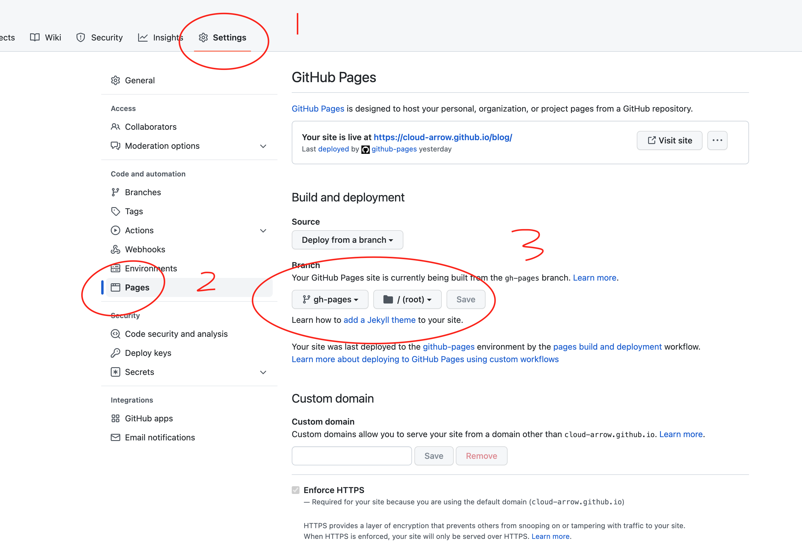
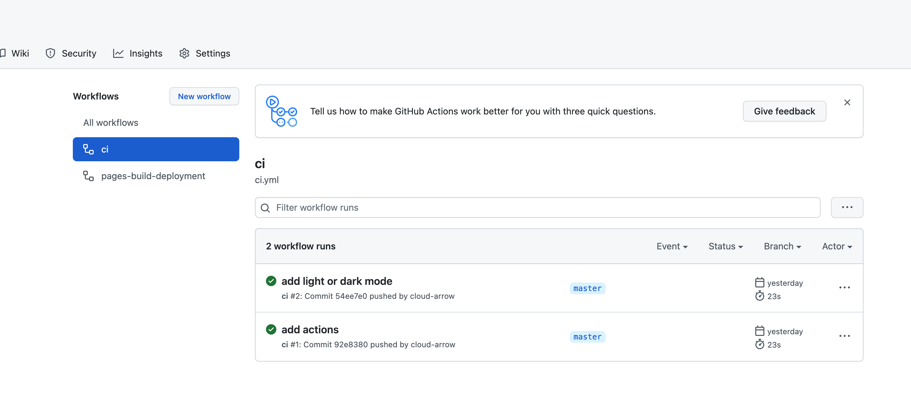
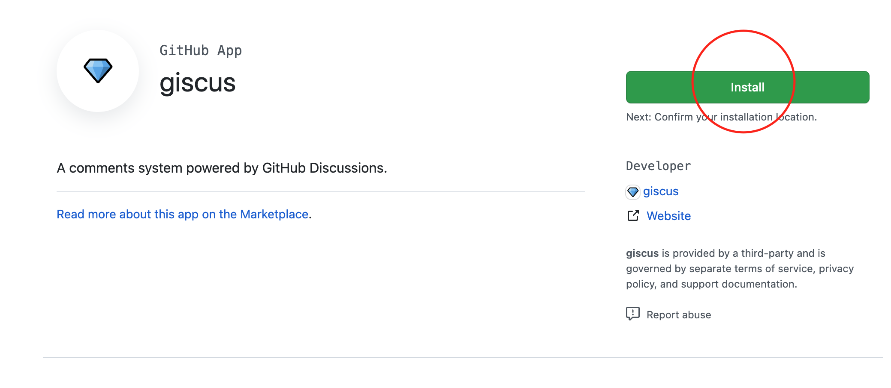

# 从0到1搭建博客

## 起因

工作多年，发现自己对外输出内容少的可怜，随着工作的深入也越发觉的输出的重要性。年龄大了，记忆也差了很多，前天刚学的后面，过几天就记不起来了。作为程序员，比较苦逼的是需要经常学习，平时看了很多的内容，缺少归纳总结。基于以上几点，所以我需要博客帮我记录一下。

## 搭建过程

### 选型

- 传统架构的cms类型，这种利用服务端模版直接渲染输出，需要数据库的支持，架构比较复杂。比如wordpress
- SSG(Static Site Generation)也叫静态站点生成器类型，原理也是相当的简单，说白了就是利用模版技术，渲染生成成静态的html文件，你拿这些生成的静态文件直接部署到web server。这种类型比较常见有[next.js](https://github.com/vercel/next.js),[hugo](https://github.com/gohugoio/hugo),[jekyll](https://github.com/jekyll/jekyll), [hexo](https://github.com/hexojs/hexo),[vuepress](https://github.com/vuejs/vuepress),[mkdocs](https://github.com/mkdocs/mkdocs)
- jamstack类型，这种是比较新型的架构，SSG+headless cms的组合可以极好的结合静态和动态，具体不在这里展开。要了解可以参考下面地址
     * [https://jamstack.org/](https://jamstack.org/)
     * [https://blog.lishunyang.com/2021/10/jamstack-blog.html](https://blog.lishunyang.com/2021/10/jamstack-blog.html)
     * [https://moe.jimmy0w0.me/2021/04/01/headless-cms-is-the-future/](https://moe.jimmy0w0.me/2021/04/01/headless-cms-is-the-future/)
     * [https://zhuanlan.zhihu.com/p/281085404](https://zhuanlan.zhihu.com/p/281085404)

这里我选择[mkdocs-material](https://squidfunk.github.io/mkdocs-material/) ,这是一款基于[mkdocs](https://github.com/mkdocs/mkdocs)的主题。选择它有如下几个原因

- 用[markdown](https://www.markdown.xyz/basic-syntax/)书写，专注写作，不用过多的配置，避免沦为工具癖
- 功能强大，自己随便定制
- 很多大厂已经入坑，作为他们的文档首选
- 主题非常的美观
- SSG类型的，比较轻量级

### 搭建

#### [安装](https://squidfunk.github.io/mkdocs-material/getting-started/)

这个静态生成器是python写的，用pip包管理工具安装

```sh
 pip install mkdocs-material
```

#### [创建](https://squidfunk.github.io/mkdocs-material/creating-your-site/)

比如我想创建的站点名称是blog

```sh
mkdocs new blog
```

看一下blog目录下的结构，docs的目录就是我们写出的文档存储目录

```
.
├─ docs/
│  └─ index.md
└─ mkdocs.yml
```

#### [配置](https://squidfunk.github.io/mkdocs-material/customization/)

主题可以各种定制，具体参考官方文档。

[https://squidfunk.github.io/mkdocs-material/setup/changing-the-colors/](https://squidfunk.github.io/mkdocs-material/setup/changing-the-colors/)

我目前的配置如下，还未折腾其他的。

```
site_name: 尘埃
theme:
  name: material
  palette:
    # Palette toggle for light mode
    - scheme: default
      toggle:
        icon: material/brightness-7
        name: Switch to dark mode

    # Palette toggle for dark mode
    - scheme: slate
      toggle:
        icon: material/brightness-4
        name: Switch to light mode
```

#### 写作

markdown的写作软件我用的是[typora](https://typora.io/),其他支持软件也都行,只要能写markdown就可以。其中有个点要注意下，markdown是有[方言](https://www.markdown.xyz/getting-started/#markdown-%E6%96%B9%E8%A8%80)的，不能的解析器可能不太一样。标准都是支持的，不标准的部分要看一下具体的解析器，如本文的[mkdocs](https://github.com/mkdocs/mkdocs)

我目前是用typora写完，直接保存在blog/docs目录中

在blog目录运行下命令，可以实时预览效果

```
mkdocs serve
```

#### [发布](https://squidfunk.github.io/mkdocs-material/publishing-your-site/)

发布有2种方式

参考官方文档

[https://squidfunk.github.io/mkdocs-material/publishing-your-site/](https://squidfunk.github.io/mkdocs-material/publishing-your-site/)

##### 手动

运行下面命令，会生成静态文件在site目录，手动部署静态文件到任何的web server即可

```
mkdocs build
```

site目录的静态文件

```
site
├── 404.html
├── assets
├── index.html
├── search
├── sitemap.xml
└── sitemap.xml.gz
```

##### 自动

利用git仓库的ci功能自动部署

这里我选择使用github,自动部署到github pages

在blog目录下执行

```
git init
```

创建`.github/workflows/ci.yml`文件，并写入下面内容

```
name: ci 
on:
  push:
    branches:
      - master 
      - main
jobs:
  deploy:
    runs-on: ubuntu-latest
    steps:
      - uses: actions/checkout@v2
      - uses: actions/setup-python@v2
        with:
          python-version: 3.x
      - run: pip install mkdocs-material 
      - run: mkdocs gh-deploy --force
```

提交代码，并推送到github上

```
git commit -m "xxxx"
git push origin master
```

设置发布的分支为gh-pages





等待ci跑完后，可以浏览站点了，`<username>.github.io/<repository>`

## 站点增强

### 配置评论功能

评论使用的是开源的[Giscus](https://giscus.app/),我们整合到博客上,具体参考官方文档。

[https://squidfunk.github.io/mkdocs-material/setup/adding-a-comment-system/#giscus-integration](https://squidfunk.github.io/mkdocs-material/setup/adding-a-comment-system/#giscus-integration)

- github安装**[Giscus GitHub App](https://github.com/apps/giscus)**并且授权访问仓库

   


- 访问**[Giscus](https://giscus.app/)** 生成js脚本,自行在站点配置即可。最终生成的脚本类似下面的

```
<script src="https://giscus.app/client.js"
        data-repo="[在此输入仓库]"
        data-repo-id="[在此输入仓库 ID]"
        data-category="[在此输入分类名]"
        data-category-id="[在此输入分类 ID]"
        data-mapping="pathname"
        data-strict="0"
        data-reactions-enabled="1"
        data-emit-metadata="0"
        data-input-position="bottom"
        data-theme="preferred_color_scheme"
        data-lang="zh-CN"
        crossorigin="anonymous"
        async>
</script>
```


- 覆盖模块模版

编辑mkdocs.yaml，加入custom_dir: overrides

```
site_name: 尘埃
theme:
  name: material
  custom_dir: overrides
  palette:
    # Palette toggle for light mode
    - scheme: default
      toggle:
        icon: material/brightness-7
        name: Switch to dark mode

    # Palette toggle for dark mode
    - scheme: slate
      toggle:
        icon: material/brightness-4
        name: Switch to light mode
```

创建overrides/main.html文件，填充下面内容

```



  {{ super() }}

  <!-- Giscus -->
  <h2 id="__comments">{{ lang.t("meta.comments") }}</h2>
  <!-- 此处粘贴上面生成的js脚本 -->

  <!-- Synchronize Giscus theme with palette -->
  <script>
    var giscus = document.querySelector("script[src*=giscus]")

    /* Set palette on initial load */
    var palette = __md_get("__palette")
    if (palette && typeof palette.color === "object") {
      var theme = palette.color.scheme === "slate" ? "dark" : "light"
      giscus.setAttribute("data-theme", theme) 
    }

    /* Register event handlers after documented loaded */
    document.addEventListener("DOMContentLoaded", function() {
      var ref = document.querySelector("[data-md-component=palette]")
      ref.addEventListener("change", function() {
        var palette = __md_get("__palette")
        if (palette && typeof palette.color === "object") {
          var theme = palette.color.scheme === "slate" ? "dark" : "light"

          /* Instruct Giscus to change theme */
          var frame = document.querySelector(".giscus-frame")
          frame.contentWindow.postMessage(
            { giscus: { setConfig: { theme } } },
            "https://giscus.app"
          )
        }
      })
    })
  </script>


```


## 总结

千里之行始于足下,不积跬步无以至千里。


